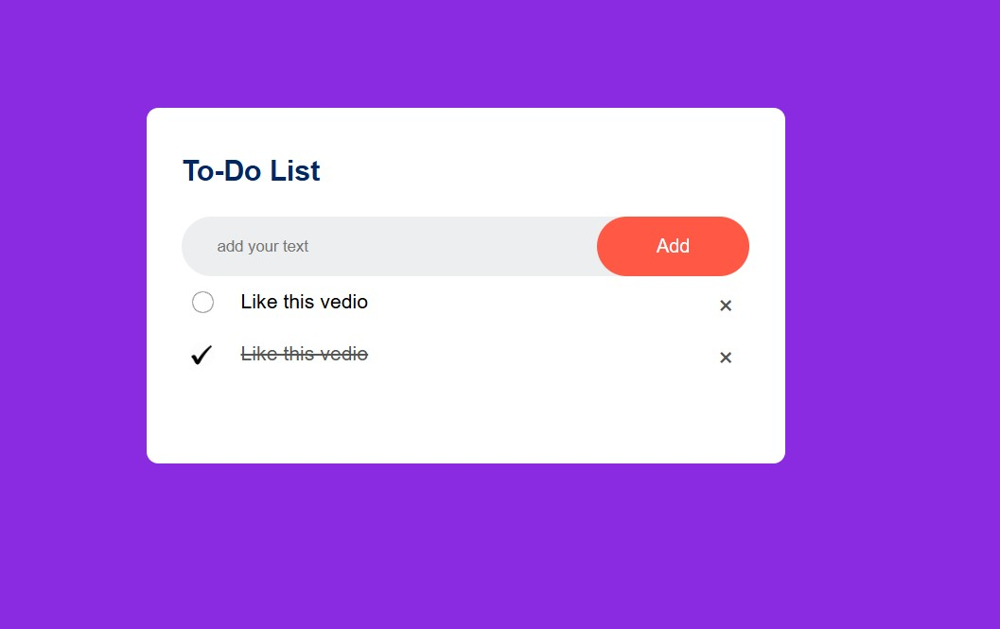

# Todolist1

easy to do list using HTML, CSS and Javascript

this project focus on javascript mainly

like creating element using dom
let li = document.createElement('li')
appending the created element using dom
listContainer.appendChild(li)

clear the input value from the input after we add the list
inputBox.value=" "

add event listener

listContainer.addEventListener('click',function(e){
if(e.target.tagName ==='LI'){
e.target.classList.toggle('checked')
}
else if(e.target.tagName === 'SPAN'){
e.target.parentElement.remove()
}
},false)

save the data to local storage to avoid loosing it during refreshing

function SaveData() {
localStorage.setItem('data',listContainer.innerHTML)
}

recover data from local storage during opening the page
function showTask() {
listContainer.innerHTML =localStorage.getItem('data')
}

the final page look like this

# Bisrat Mengesha

# june 1 2024 Dallas, Tx.
